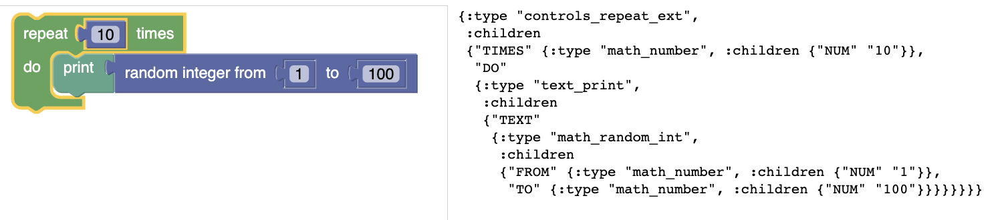

# blockoid

A thin Clojurescript wrapping of [Blockly](https://developers.google.com/blockly/), a library for building Scratch-like interfaces in the browser.

The combination of Blockly and Clojure allows for the easy creation of powerful combinatorial user interfaces and visual languages. See [this presentation](https://drive.google.com/file/d/1Jfc94u42BDqmwSFDazTplDfVjzc1eVej/view?usp=sharing) for a real-world example of use.




## Usage

Add to dependencies:

    [org.parkerici/blockoid "0.3.5"] 

See [the example](example/project.clj) for details. 

In your code, add the `require`:

```clojure
(ns ...
  (:require [org.parkerici.blockoid.core :as blockoid]))
```

Usage details are in (a separate document)[doc/blockoid.md].

Blockoid loads Blockly via [a cljsjs package](https://github.com/cljsjs/packages/tree/master/blockly). If you need a newer version of Blockly, you will need to update cljsjs.

## License

Relased under MIT license. See the [LICENSE](LICENSE.md) file for details.


## Deploy to Clojars

	x- run 'lein deploy clojars' in terminal (not emacs)
- supply token (in password manager) for password when prompted

### One-time setup

    brew install npm
	npm install -g shadow-cljs

    npm install

### Building app

    shadow-cljs compile app

To develop with automatic reload

    shadow-cljs watch app

### Installing for local use

    npm link
	
Argh, looks like the usual fuckwit stuff: https://medium.com/@debshish.pal/publish-a-npm-package-locally-for-testing-9a00015eb9fd


### Installing for global use

    
